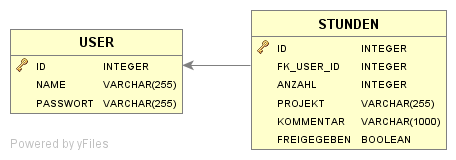

# techtalkdemo

## Voraussetzungen

- Eclipse mit Plugins für git und maven
- Maven

## Initiales Setup

1. git clone https://github.com/tkuconet/techtalkdemo.git (alternativ mit Eclipse-Plugin)
2. cd techtalkdemo
3. mvn jetty:run
4. http://localhost:8080/root 

## Aufgabenstellung

Dieses Repository enthält eine Vorlage für eine einfache Webanwendung zur Zeiterfassung. Als Beispiel wird eine In-Memory-Datenbank verwendet, die beim Start der Anwendung mit ein paar Daten vorbelegt wird.

Die Datenbank enthält Userdaten (Name, Passwort) und userbezogene Datensätze für die Zeiterfassung (Anzahl Stunden, Projektbezeichnung, Kommentar, Freigabe-Flag):

Außer dem Datenbankschema sind drei Seiten vorgegeben, die exemplarisch mit der Datenbank interagieren:

1. root.jsp + RootServlet.java = Startseite
2. main.jsp + MainServlet.java = Hauptseite zum Eingeben und Suchen von Datensätzen
3. detail.jsp + DetailServlet.java = Detailseite zu einem ausgewählten Datensatz

Im Rahmen des TechTalks sind diese Seiten um die folgenden Features zu ergänzen:

- Startseite: Login-Mechanismus mit Weiterleitung auf Hauptseite bei Erfolg
- Startseite: Weiterleitung auf Hauptseite falls User bereits angemeldet ist
- Detailseite: Anzeige der Detaildaten zu einem bestimmten Datensatz
- Hauptseite: Link zur Detailseite für jeden Datensatz
- Hauptseite: Formular zur Erfassung von Datensätzen
- Hauptseite: Anzeige eigener Datensätze und freigegebener Datensätze aller andereren User
- Hauptseite: Filterung der Ergebnisliste nach Projektbezeichnung und Kommentar, jeweils mit * und ? als Platzhalter

## Randbedingung

Für die Umsetzung der Aufgabe sind nur die bereits referenzierten Abhängigkeiten erlaubt.
Die Anwendung soll nur mit Hilfe von JSP, Servlets und JDBC erstellt werden.  

